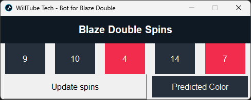
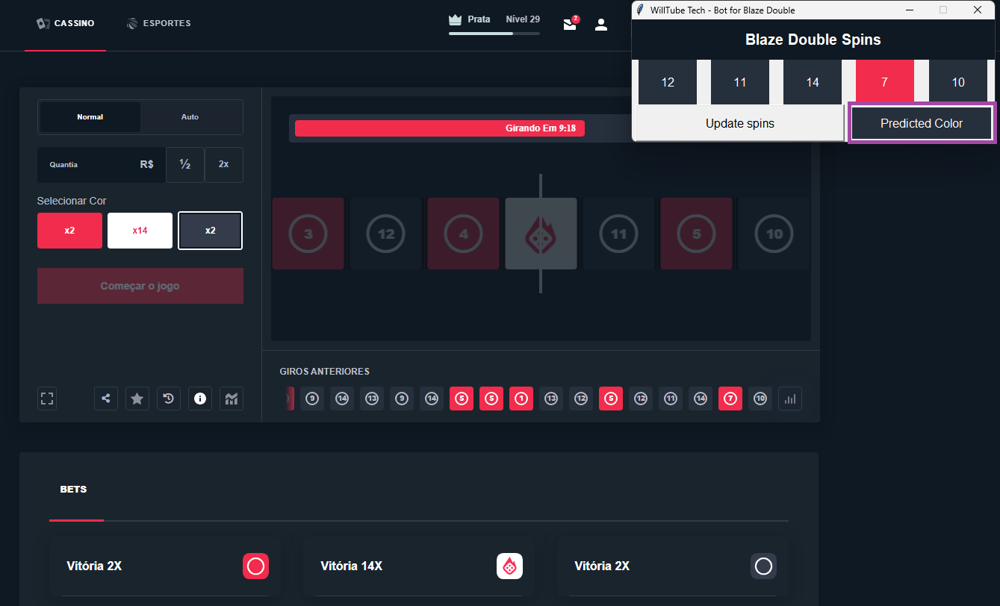
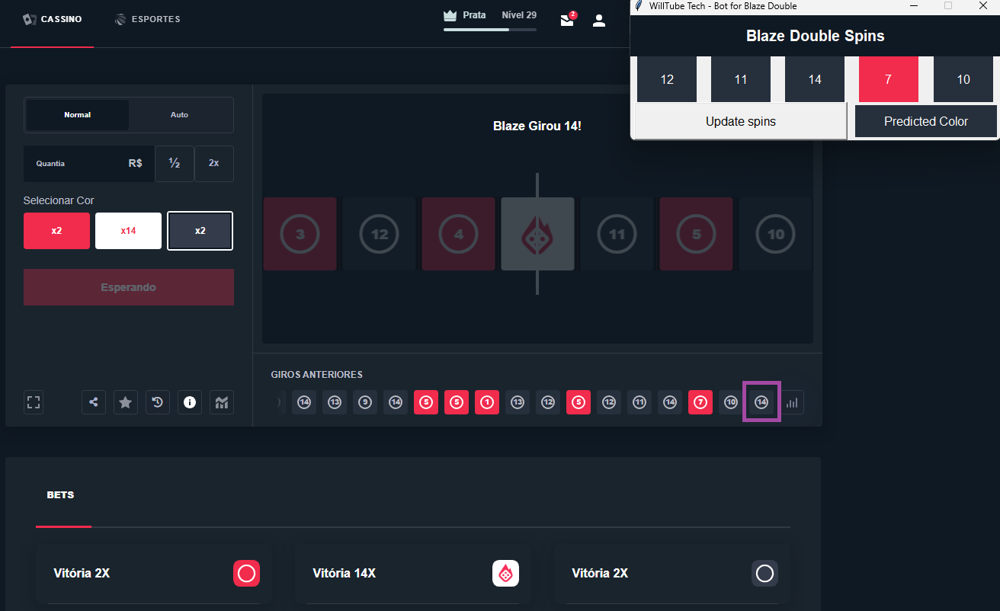

# Blaze Double Bot

Este é um simples bot para acompanhar as últimas jogadas do Blaze Double, exibindo as cinco jogadas mais recentes, suas cores e prevendo a próxima cor com base na soma das cores anteriores.

|App|Previsão|Cor/Numero Sorteado
|-------------------------------|-------------------------------|-------------------------------|
|  |  |  |

### Como Usar
Certifique-se de ter o Python instalado em seu sistema. Você pode baixá-lo em [python.org](https://www.python.org/downloads/).

1. Clone ou faça o download deste repositório:
    - `git clone https://github.com/WilliamElesbao/Python-Blaze-Double-Bot.git`

2. Instale as dependências necessárias:
    - `pip install requests`

3. Execute o script:
    - `python app.py`

4. Clique no botão "Update spins" para obter as jogadas mais recentes e a previsão da próxima cor.

### Dependências
- Tkinter
- Requests

### Notas

Certifique-se de ter uma conexão com a internet para obter as últimas jogadas do Blaze Double.

Este projeto é apenas para fins educacionais e de demonstração.

Sinta-se à vontade para fazer ajustes e melhorias de acordo com suas necessidades. Se você encontrar problemas ou tiver sugestões, por favor, abra uma issue.
